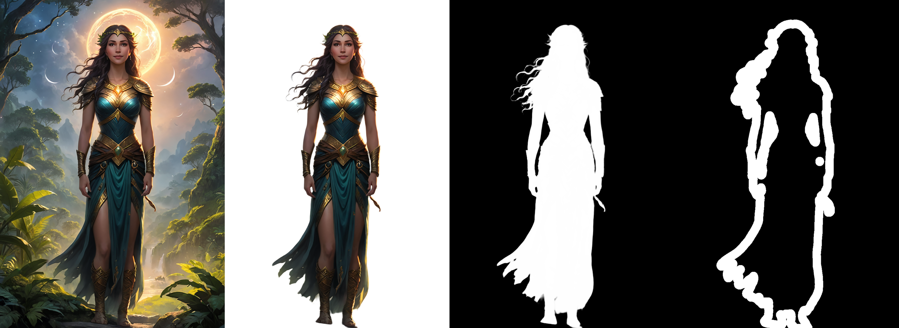

# BiRefNet background removal for Stable Diffusion WebUI

This extension is for AUTOMATIC1111's [Stable Diffusion web UI](https://github.com/AUTOMATIC1111/stable-diffusion-webui), it allows to add a BiRefNet section to the original Stable Diffusion WebUI's Extras tab to benefit from [BiRefNet](https://github.com/ZhengPeng7/BiRefNet) background removal feature.

Find the UI for BiRefNet background removal in the Extras tab after installing the extension.

## Installation

1. Open "Extensions" tab.
1. Open "Install from URL" tab in the tab.
1. Enter https://github.com/dimitribarbot/sd-webui-birefnet.git to "URL for extension's git repository".
1. Press "Install" button.
1. It may take a few minutes to install the extension. At the end, you will see the message "Installed into stable-diffusion-webui\extensions\sd-webui-birefnet. Use Installed tab to restart".
1. Go to "Installed" tab, click "Check for updates", and then click "Apply and restart UI". (The next time you can also use these buttons to update this extension.)

## Models

The available models are:

- General: A pre-trained model for general use cases.
- General-Lite: A light pre-trained model for general use cases.
- General-Lite-2K: A light pre-trained model for general use cases in high resolution (2560x1440).
- Portrait: A pre-trained model for human portraits.
- Matting: A pre-trained model for general trimap-free matting use.
- DIS: A pre-trained model for dichotomous image segmentation (DIS).
- HRSOD: A pre-trained model for high-resolution salient object detection (HRSOD).
- COD: A pre-trained model for concealed object detection (COD).
- DIS-TR_TEs: A pre-trained model with massive dataset.

Model files go here (automatically downloaded if the folder is not present during first run): `stable-diffusion-webui/models/birefnet`.  

If necessary, they can be downloaded from:
- [General](https://huggingface.co/ZhengPeng7/BiRefNet/resolve/main/model.safetensors) ➔ `model.safetensors` must be renamed `General.safetensors`
- [General-Lite](https://huggingface.co/ZhengPeng7/BiRefNet_T/resolve/main/model.safetensors) ➔ `model.safetensors` must be renamed `General-Lite.safetensors`
- [General-Lite-2K](https://huggingface.co/ZhengPeng7/BiRefNet_lite-2K/resolve/main/model.safetensors) ➔ `model.safetensors` must be renamed `General-Lite-2K.safetensors`
- [Portrait](https://huggingface.co/ZhengPeng7/BiRefNet-portrait/resolve/main/model.safetensors) ➔ `model.safetensors` must be renamed `Portrait.safetensors`
- [Matting](https://huggingface.co/ZhengPeng7/BiRefNet-matting/resolve/main/model.safetensors) ➔ `model.safetensors` must be renamed `Matting.safetensors`
- [DIS](https://huggingface.co/ZhengPeng7/BiRefNet-DIS5K/resolve/main/model.safetensors) ➔ `model.safetensors` must be renamed `DIS.safetensors`
- [HRSOD](https://huggingface.co/ZhengPeng7/BiRefNet-HRSOD/resolve/main/model.safetensors) ➔ `model.safetensors` must be renamed `HRSOD.safetensors`
- [COD](https://huggingface.co/ZhengPeng7/BiRefNet-COD/resolve/main/model.safetensors) ➔ `model.safetensors` must be renamed `COD.safetensors`
- [DIS-TR_TEs](https://huggingface.co/ZhengPeng7/BiRefNet-DIS5K-TR_TEs/resolve/main/model.safetensors) ➔ `model.safetensors` must be renamed `DIS-TR_TEs.safetensors`

## API
Routes have been added to the Automatic1111's SD WebUI API:
- `/birefnet/single`: remove background of a single image.
- `/birefnet/multi`: remove background of a multiple images.

Both endpoints share these parameters:
- `return_foreground`: whether to return foreground image (input image without its background).
- `return_mask`: whether to return mask (can be used for inpainting).
- `return_edge_mask`: whether to return edge mask (can be used to blend foreground image with another background).
- `edge_mask_width`: edge mask width in pixels. Default to 64.
- `model_name`: `General`, `General-Lite`, `General-Lite-2K`, `Portrait`, `Matting`, `DIS`, `HRSOD`, `COD` or `DIS-TR_TEs`. BiRefNet model to be used. Default to `General`.
- `output_dir`: directory to save output images.
- `output_extension`: output image file extension (without leading dot, `png` by default).
- `device_id`: GPU device id.
- `send_output`: `true` if you want output images to be sent as base64 encoded strings, `false` otherwise.
- `save_output`: `true` if you want output images to be saved in `output_dir`, `false` otherwise.
- `use_model_cache`: `true` if you want BiRefNet model to be cached for subsequent calls using same model name, `false` otherwise.
- `flag_force_cpu`: force cpu inference.

Additional parameters for the `/birefnet/single` endpoint are:
- `image`: source image. It can either be a path to an existing file or an url or a base64 encoded string.
- `resolution`: source image resolution. Keep it empty to automatically detect source image size.

Additional parameters for the `/birefnet/multi` endpoint are:
- `inputs`: an array of objects with the following arguments:
    - `image`: source image. It can either be a path to an existing file or an url or a base64 encoded string.
    - `resolution`: source image resolution. Keep it empty to automatically detect source image size.

## Thanks

Original author's link: https://github.com/ZhengPeng7/BiRefNet